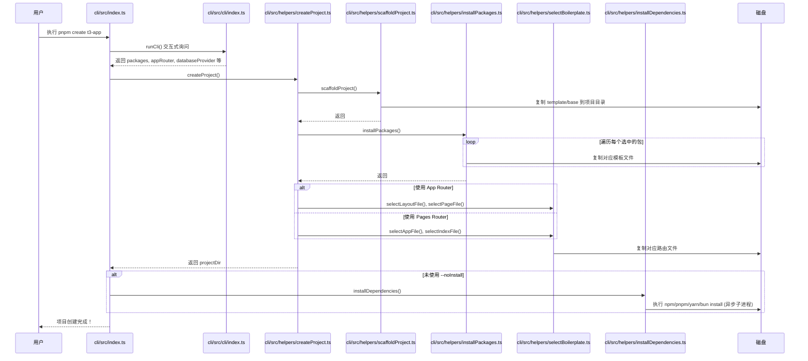

# Create-T3-App CLI 工作流程说明

本文档面向初学者，详细解释从执行 CLI 命令到磁盘上出现完整项目的完整链路。

## 目录

- [整体流程图](#整体流程图)
- [详细步骤说明](#详细步骤说明)
- [同步操作 vs 异步操作](#同步操作-vs-异步操作)
- [App Router vs Pages Router 分支](#app-router-vs-pages-router-分支)
- [PkgInstallerMap 与 Installer 机制](#pkginstallermap-与-installer-机制)
- [关键文件路径](#关键文件路径)

---

## 整体流程图



---

## 详细步骤说明

整个流程至少包含 **8 个关键步骤**：

### 步骤 1：入口点启动

**文件**: `cli/src/index.ts` 的 `main()` 函数

当用户执行 `pnpm create t3-app` 时，Node.js 会执行这个文件。`main()` 是一个异步函数，是整个流程的起点。

```typescript
const main = async () => {
  // 1. 渲染标题和版本警告
  renderTitle();
  
  // 2. 运行 CLI 交互
  const { appName, packages, flags, databaseProvider } = await runCli();
  
  // 3. 构建安装器映射
  const usePackages = buildPkgInstallerMap(packages, databaseProvider);
  
  // 4. 创建项目
  const projectDir = await createProject({ ... });
  
  // 5. 后续处理（安装依赖、Git 初始化等）
};
```

### 步骤 2：CLI 交互式询问

**文件**: `cli/src/cli/index.ts` 的 `runCli()` 函数

这是一个**异步**操作，使用 `@clack/prompts` 库向用户询问一系列问题：

| 问题 | 对应选项 |
|------|----------|
| 项目名称是什么？ | `appName` |
| 使用 TypeScript 还是 JavaScript？ | （强制 TypeScript） |
| 是否使用 Tailwind CSS？ | `tailwind` |
| 是否使用 tRPC？ | `trpc` |
| 使用什么认证方案？ | `nextAuth` / `betterAuth` / 无 |
| 使用什么数据库 ORM？ | `prisma` / `drizzle` / 无 |
| 是否使用 Next.js App Router？ | `appRouter` |
| 使用什么数据库提供商？ | `sqlite` / `mysql` / `postgres` / `planetscale` |
| 使用什么代码检查工具？ | `eslint` / `biome` |
| 是否初始化 Git？ | `noGit` |
| 是否自动安装依赖？ | `noInstall` |
| 使用什么导入别名？ | `importAlias` |

最后返回一个包含所有选择的对象：

```typescript
return {
  appName: "my-t3-app",
  packages: ["tailwind", "trpc", "prisma", "eslint"],
  databaseProvider: "sqlite",
  flags: {
    appRouter: true,
    noGit: false,
    noInstall: false,
    importAlias: "~/",
  },
};
```

### 步骤 3：构建安装器映射

**文件**: `cli/src/installers/index.ts` 的 `buildPkgInstallerMap()` 函数

这是一个**同步**操作，将用户选择的包名数组转换为 `PkgInstallerMap` 对象：

```typescript
const usePackages = buildPkgInstallerMap(packages, databaseProvider);
```

返回的结构类似：

```typescript
{
  tailwind: { inUse: true, installer: tailwindInstaller },
  trpc: { inUse: true, installer: trpcInstaller },
  prisma: { inUse: true, installer: prismaInstaller },
  nextAuth: { inUse: false, installer: nextAuthInstaller },
  betterAuth: { inUse: false, installer: betterAuthInstaller },
  drizzle: { inUse: false, installer: drizzleInstaller },
  envVariables: { inUse: true, installer: envVariablesInstaller },  // 始终启用
  eslint: { inUse: true, installer: dynamicEslintInstaller },
  biome: { inUse: false, installer: biomeInstaller },
  dbContainer: { inUse: false, installer: dbContainerInstaller },  // 仅 mysql/postgres
}
```

### 步骤 4：创建项目目录并脚手架

**文件**: `cli/src/helpers/createProject.ts` 的 `createProject()` 函数

首先调用 `scaffoldProject()`：

**文件**: `cli/src/helpers/scaffoldProject.ts`

这是**同步**文件操作，执行以下步骤：

1. 检查目标目录是否存在
   - 如果存在且非空，询问用户如何处理（中止 / 清空 / 覆盖）
2. 复制基础模板
   ```typescript
   const srcDir = path.join(PKG_ROOT, "template/base");
   fs.copySync(srcDir, projectDir);
   ```
3. 重命名 `.gitignore` 文件
   ```typescript
   fs.renameSync(
     path.join(projectDir, "_gitignore"),
     path.join(projectDir, ".gitignore")
   );
   ```

`template/base` 目录包含一个最小的 Next.js 项目结构：
- `package.json`
- `next.config.js`
- `tsconfig.json`
- `src/env.js`
- `src/styles/globals.css`
- `public/favicon.ico`
- `README.md`
- `_gitignore`

### 步骤 5：安装选中的包（复制模板文件）

**文件**: `cli/src/helpers/installPackages.ts` 的 `installPackages()` 函数

这是**同步**操作，遍历 `PkgInstallerMap` 中所有 `inUse: true` 的包，调用对应的 `installer` 函数：

```typescript
for (const [name, pkgOpts] of Object.entries(packages)) {
  if (pkgOpts.inUse) {
    pkgOpts.installer(options);  // 调用对应的安装器
  }
}
```

每个 `installer` 函数（如 `tailwindInstaller`、`prismaInstaller` 等）会：
1. 复制对应的模板文件到项目目录
2. 修改 `package.json` 添加依赖
3. 修改配置文件（如 `tailwind.config.js`、`prisma/schema.prisma`）

例如 `tailwindInstaller` 会：
- 复制 `postcss.config.js`
- 复制 `tailwind.config.js`
- 在 `package.json` 中添加 `tailwindcss`、`postcss`、`autoprefixer` 依赖

### 步骤 6：选择路由模板文件

**文件**: `cli/src/helpers/selectBoilerplate.ts`

这是**同步**操作，根据用户选择的路由模式（App Router 或 Pages Router）选择不同的入口文件。

#### App Router 模式 (`appRouter: true`)

```typescript
if (appRouter) {
  // 复制 App Router 专用的 next.config.js
  fs.copyFileSync(
    path.join(PKG_ROOT, "template/extras/config/next-config-appdir.js"),
    path.join(projectDir, "next.config.js")
  );
  
  selectLayoutFile({ projectDir, packages });  // src/app/layout.tsx
  selectPageFile({ projectDir, packages });    // src/app/page.tsx
}
```

#### Pages Router 模式 (`appRouter: false`)

```typescript
else {
  selectAppFile({ projectDir, packages });    // src/pages/_app.tsx
  selectIndexFile({ projectDir, packages });  // src/pages/index.tsx
}
```

#### 模板选择逻辑

这些函数会根据已启用的包组合选择最合适的模板文件：

| 函数 | 选择依据 | 示例 |
|------|----------|------|
| `selectLayoutFile` | tRPC + Tailwind | `with-trpc-tw.tsx` |
| `selectPageFile` | tRPC + Tailwind + Auth | `with-auth-trpc-tw.tsx` |
| `selectAppFile` | tRPC + Tailwind + Auth | `with-auth-trpc-tw.tsx` |
| `selectIndexFile` | tRPC + Tailwind | `with-trpc-tw.tsx` |

例如，如果用户同时选择了 `tRPC`、`Tailwind` 和 `NextAuth`，`selectPageFile` 会选择 `with-auth-trpc-tw.tsx` 作为 `src/app/page.tsx`。

### 步骤 7：安装 npm 依赖

**文件**: `cli/src/helpers/installDependencies.ts` 的 `installDependencies()` 函数

这是**异步**操作，通过子进程执行包管理器的 install 命令：

```typescript
const subprocess = execa(pkgManager, ["install"], { cwd: projectDir });
```

支持的包管理器：
- `npm` - 使用 `npm install`
- `pnpm` - 使用 `pnpm install`
- `yarn` - 使用 `yarn`
- `bun` - 使用 `bun install`

> **注意**: 如果用户使用了 `--noInstall` 标志，这一步会被跳过。

### 步骤 8：后续处理与完成

回到 `cli/src/index.ts` 的 `main()` 函数，还有以下步骤：

1. **更新 package.json**
   - 设置项目名称
   - 添加 `ct3aMetadata` 记录创建时的版本
   - 设置 `packageManager` 字段（Bun 除外）

2. **设置导入别名**（如果不是默认的 `~/`）
   ```typescript
   if (importAlias !== "~/") {
     setImportAlias(projectDir, importAlias);
   }
   ```

3. **生成 Prisma Client**（如果使用了 Prisma）
   ```typescript
   if (usePackages.prisma.inUse) {
     await execa("npx", ["prisma", "generate"], { cwd: projectDir });
   }
   ```

4. **格式化项目代码**
   - 使用 ESLint + Prettier 或 Biome

5. **初始化 Git 仓库**（如果没有使用 `--noGit`）
   ```typescript
   if (!noGit) {
     await initializeGit(projectDir);
   }
   ```

6. **输出下一步操作提示**
   ```typescript
   await logNextSteps({ ... });
   ```

---

## 同步操作 vs 异步操作

### 同步文件操作

以下操作是**同步**的，会阻塞主线程直到完成：

| 操作 | 函数 | 说明 |
|------|------|------|
| 复制基础模板 | `scaffoldProject()` | `fs.copySync()` |
| 重命名 .gitignore | `scaffoldProject()` | `fs.renameSync()` |
| 复制包模板文件 | `installPackages()` | 各 installer 中的 `fs.copySync()` |
| 选择路由文件 | `select*File()` | `fs.copySync()` |
| 读取/写入 package.json | `main()` | `fs.readJSONSync()` / `fs.writeJSONSync()` |

### 异步子进程操作

以下操作是**异步**的，通过子进程执行，不会阻塞主线程：

| 操作 | 函数 | 说明 |
|------|------|------|
| CLI 交互询问 | `runCli()` | 等待用户输入 |
| 安装 npm 依赖 | `installDependencies()` | `execa(pkgManager, ["install"])` |
| 生成 Prisma Client | `main()` | `execa("npx", ["prisma", "generate"])` |
| 初始化 Git | `initializeGit()` | `execa("git", ["init"])` 等 |
| 格式化代码 | `formatProject()` | `execa()` 执行 lint/format 命令 |

---

## App Router vs Pages Router 分支

### 关键差异点

在 `cli/src/helpers/createProject.ts` 中有一个关键的条件分支：

```typescript
if (appRouter) {
  // App Router 模式
  fs.copyFileSync(
    path.join(PKG_ROOT, "template/extras/config/next-config-appdir.js"),
    path.join(projectDir, "next.config.js")
  );
  
  selectLayoutFile({ projectDir, packages });
  selectPageFile({ projectDir, packages });
} else {
  // Pages Router 模式
  selectAppFile({ projectDir, packages });
  selectIndexFile({ projectDir, packages });
}
```

### 模板文件位置对比

| 路由模式 | 入口文件 | 模板源路径 |
|----------|----------|------------|
| **App Router** | `src/app/layout.tsx` | `template/extras/src/app/layout/` |
| **App Router** | `src/app/page.tsx` | `template/extras/src/app/page/` |
| **Pages Router** | `src/pages/_app.tsx` | `template/extras/src/pages/_app/` |
| **Pages Router** | `src/pages/index.tsx` | `template/extras/src/pages/index/` |

### 为什么需要不同的模板？

Next.js 的两种路由模式有不同的入口机制：

- **Pages Router**: 使用 `_app.tsx` 作为全局包装器，`index.tsx` 作为首页
- **App Router**: 使用 `layout.tsx` 作为布局组件，`page.tsx` 作为页面内容

此外，App Router 的 `next.config.js` 需要额外配置：

```javascript
// next-config-appdir.js
const config = {
  reactStrictMode: true,
  experimental: {
    serverComponentsExternalPackages: ["@prisma/client"],
  },
};
```

---

## PkgInstallerMap 与 Installer 机制

### 核心概念

`PkgInstallerMap` 是整个包安装系统的核心数据结构，定义在 `cli/src/installers/index.ts`：

```typescript
export type PkgInstallerMap = Record<
  AvailablePackages,
  {
    inUse: boolean;        // 用户是否选择了这个包
    installer: Installer;   // 对应的安装器函数
  }
>;
```

### 可用的包与安装器

| 包名 (`AvailablePackages`) | 安装器函数 | 功能 |
|---------------------------|------------|------|
| `nextAuth` | `nextAuthInstaller` | NextAuth.js 认证 |
| `betterAuth` | `betterAuthInstaller` | BetterAuth 认证 |
| `prisma` | `prismaInstaller` | Prisma ORM |
| `drizzle` | `drizzleInstaller` | Drizzle ORM |
| `tailwind` | `tailwindInstaller` | Tailwind CSS |
| `trpc` | `trpcInstaller` | tRPC API |
| `envVariables` | `envVariablesInstaller` | 环境变量配置（始终启用） |
| `eslint` | `dynamicEslintInstaller` | ESLint + Prettier |
| `biome` | `biomeInstaller` | Biome 代码检查 |
| `dbContainer` | `dbContainerInstaller` | Docker 数据库容器（仅 mysql/postgres） |

### 调用时机与流程

#### 1. 构建阶段 (`buildPkgInstallerMap`)

在 `cli/src/index.ts` 中：

```typescript
const { packages, databaseProvider } = await runCli();
const usePackages = buildPkgInstallerMap(packages, databaseProvider);
```

`buildPkgInstallerMap` 函数的逻辑：

```typescript
export const buildPkgInstallerMap = (
  packages: AvailablePackages[],
  databaseProvider: DatabaseProvider
): PkgInstallerMap => ({
  nextAuth: {
    inUse: packages.includes("nextAuth"),  // 检查用户是否选择
    installer: nextAuthInstaller,
  },
  // ... 其他包类似
  
  // 特殊：dbContainer 仅在使用 mysql 或 postgres 时启用
  dbContainer: {
    inUse: ["mysql", "postgres"].includes(databaseProvider),
    installer: dbContainerInstaller,
  },
  
  // 特殊：envVariables 始终启用
  envVariables: {
    inUse: true,
    installer: envVariablesInstaller,
  },
});
```

#### 2. 执行阶段 (`installPackages`)

在 `cli/src/helpers/installPackages.ts` 中：

```typescript
export const installPackages = (options: InstallPackagesOptions) => {
  const { packages } = options;
  
  for (const [name, pkgOpts] of Object.entries(packages)) {
    if (pkgOpts.inUse) {
      // 只执行 inUse 为 true 的安装器
      pkgOpts.installer(options);
    }
  }
};
```

### Installer 函数示例

以 `tailwindInstaller` 为例（`cli/src/installers/tailwind.ts`）：

```typescript
export const tailwindInstaller: Installer = ({ projectDir }) => {
  // 1. 复制配置文件
  fs.copySync(
    path.join(PKG_ROOT, "template/extras/config/postcss.config.js"),
    path.join(projectDir, "postcss.config.js")
  );
  
  // 2. 复制 tailwind.config.js（根据路由模式选择不同版本）
  // ...
  
  // 3. 添加依赖到 package.json
  addPackageDependency({
    projectDir,
    dependencies: ["tailwindcss", "postcss", "autoprefixer"],
    devMode: true,
  });
  
  // 4. 修改 globals.css 添加 Tailwind 指令
  // ...
};
```

### 与用户选择的对应关系

```
用户交互 (runCli)
    │
    ├─── 选择 "使用 Tailwind CSS?" → Yes
    │         ↓
    │    packages.push("tailwind")
    │         ↓
    │    buildPkgInstallerMap()
    │         ↓
    │    { tailwind: { inUse: true, installer: tailwindInstaller } }
    │         ↓
    │    installPackages()
    │         ↓
    │    tailwindInstaller(options)  ← 执行
    │
    ├─── 选择 "使用 tRPC?" → Yes
    │         ↓
    │    packages.push("trpc")
    │         ↓
    │    ... 同上 ...
    │
    └─── 选择 "使用 Prisma?" → No
              ↓
         packages 不包含 "prisma"
              ↓
         { prisma: { inUse: false, ... } }
              ↓
         跳过 prismaInstaller
```

---

## 关键文件路径

### 入口与 CLI

| 文件路径 | 说明 |
|----------|------|
| `cli/src/index.ts` | 主入口，`main()` 函数 |
| `cli/src/cli/index.ts` | CLI 交互逻辑，`runCli()` 函数 |

### 核心流程

| 文件路径 | 说明 |
|----------|------|
| `cli/src/helpers/createProject.ts` | 项目创建主逻辑 |
| `cli/src/helpers/scaffoldProject.ts` | 脚手架（复制基础模板） |
| `cli/src/helpers/installPackages.ts` | 执行包安装器 |
| `cli/src/helpers/selectBoilerplate.ts` | 选择路由模板文件 |
| `cli/src/helpers/installDependencies.ts` | 执行 npm install |

### 安装器

| 文件路径 | 说明 |
|----------|------|
| `cli/src/installers/index.ts` | `PkgInstallerMap` 定义与 `buildPkgInstallerMap()` |
| `cli/src/installers/tailwind.ts` | Tailwind 安装器 |
| `cli/src/installers/trpc.ts` | tRPC 安装器 |
| `cli/src/installers/prisma.ts` | Prisma 安装器 |
| `cli/src/installers/drizzle.ts` | Drizzle 安装器 |
| `cli/src/installers/nextAuth.ts` | NextAuth 安装器 |
| `cli/src/installers/betterAuth.ts` | BetterAuth 安装器 |
| `cli/src/installers/envVars.ts` | 环境变量安装器 |
| `cli/src/installers/eslint.ts` | ESLint 安装器 |
| `cli/src/installers/biome.ts` | Biome 安装器 |
| `cli/src/installers/dbContainer.ts` | Docker 数据库容器安装器 |

### 模板文件

| 路径 | 说明 |
|------|------|
| `cli/template/base/` | 基础 Next.js 项目模板 |
| `cli/template/extras/src/app/layout/` | App Router layout 模板 |
| `cli/template/extras/src/app/page/` | App Router page 模板 |
| `cli/template/extras/src/pages/_app/` | Pages Router _app 模板 |
| `cli/template/extras/src/pages/index/` | Pages Router index 模板 |
| `cli/template/extras/config/` | 配置文件模板 |
| `cli/template/extras/src/server/` | 服务端代码模板 |
| `cli/template/extras/prisma/` | Prisma Schema 模板 |

---

## 总结

整个 Create-T3-App CLI 的工作流程可以概括为：

1. **询问** - 通过交互式 CLI 收集用户偏好
2. **映射** - 将用户选择转换为安装器映射
3. **脚手架** - 复制基础项目模板
4. **定制** - 根据选择的包复制对应模板文件
5. **路由** - 根据 App/Pages Router 选择入口文件
6. **安装** - 通过子进程安装 npm 依赖
7. **收尾** - Git 初始化、代码格式化等
8. **提示** - 输出下一步操作指南

理解这个流程有助于：
- 调试 CLI 问题
- 贡献新的包安装器
- 自定义项目模板
